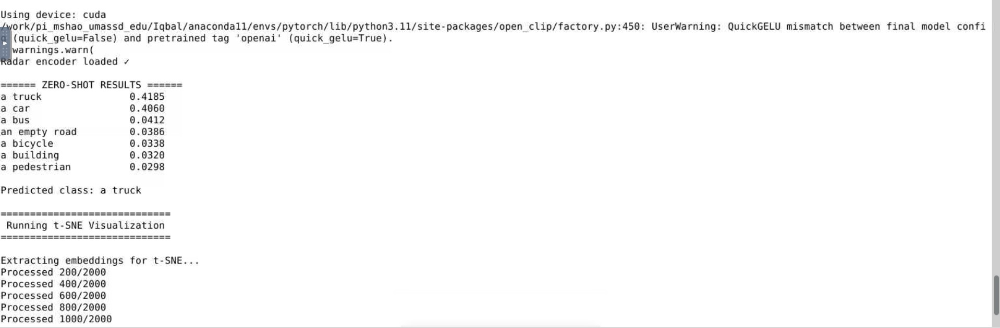
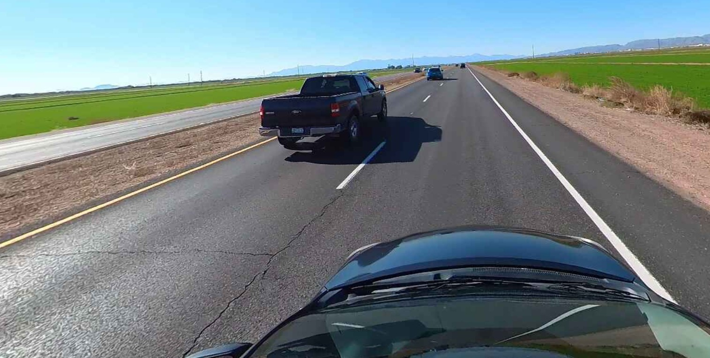
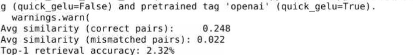
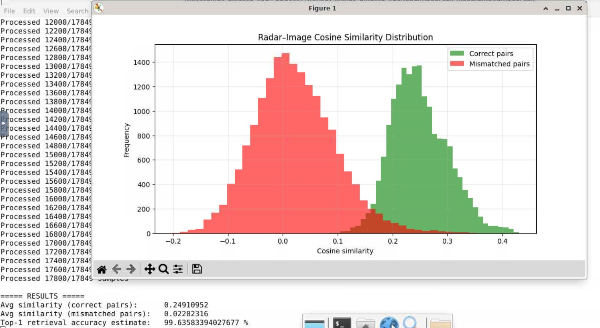

# RadarCLIP

Inference: 
We have loaded a radar file (mat file) and encoded using our trained RadarEncoder. 

And then compared it to CLIP text embeddings (“a truck”, “a car”, “a bus”, etc.). 
Here is the result,

From the CSV file, we checked the corresponding image file. It is shown below, 

So, alignment is perfect! 

